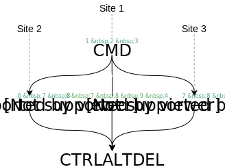
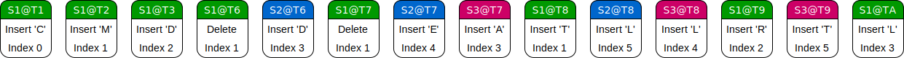
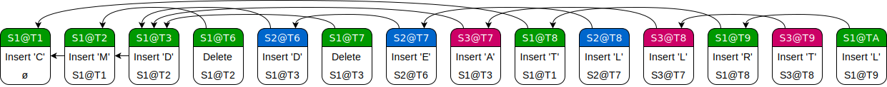
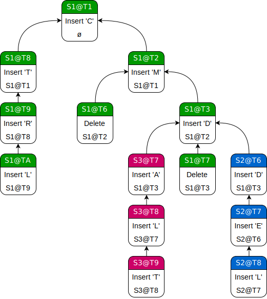
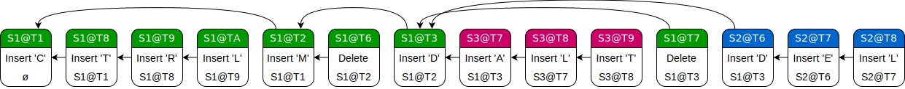

(This is going to be a bit long but hopefully not too boring! Please bear with me because there are a lot of fundamentals to cover before getting to the good stuff. I'll try to keep it brief, but if you want to get to the meat of this article, [click here][sec-ct]. And be sure to check out the [demo section][sec-demo].)

Embarrassingly, my app dev endeavors have mostly been confined to local devices. Programmers like to gloat about the stupendous mental castles they build of their circutous, multi-level architectures, but not me. In truth, networks leave me quite perplexed. I start thinking about data serializing to bits, servers performing their secret handshakes, distant operations forming into an ordered history, merge conflicts pushing into userspace and starting the whole process over again — and it all just turns to mush in my head. For peace of mind, my code needs to be *locally provable*, and this means things like idempotent functions, immediate mode rendering, contiguous structures in memory, dependency injection. Networks, unfortunately, throw a giant wrench in the works.

About month ago, after realizing that most of my ideas for future document-based apps would probably require CloudKit sync and collaboration, I decided to take a stab at solving this problem in my own special way. There were tons of frameworks that purported to do the hard work for me, but I didn't want to black-box my data model. It simply *couldn't* be the case that this sort of thing was solely in the domain of mega-corporations and sequestered network gurus. My gut told me that there had to be some arcane bit of foundational knowledge — some *gold nugget of truth* — that would allow me to network my documents using a more functional approach. Instead of downloading a Github framework and [smacking the build button](http://amzn.to/2iigBOI), I wanted to develop a base set of skills that would allow me to easily network *any* document-based app in the future.

<!--more-->

Pondering, I layed out the wishlist for my hypothetical architecture:

* Most obviously, users should be able to edit their documents immediately, without even touching the network. (In other words, the system would require "optimistic concurrency".)
* Sync should happen in the background, completely separate from the main application code, and any remote changes should be seamlessly integrated in real-time. (Put another way, sync should be treated as a kind of progressive enchancement.) 
* Merge should always be automatic, even for concurrent edits. The user should never be faced with a "pick the correct revision" dialog box.
* A user should be able to work on their document offline for an indefinite period of time without accruing "sync debt". (Meaning that if, for example, sync is accomplished by way of an operation log, performance should not suffer even if a user spends a month offline and then sends all their hundreds of changes at once.) 
* Secondary data structures and state should be minimized. Most of the extra information required for sync should be stored in the same place as the document, and moving the document to a new device should not break sync. (No irreplacable caches!)
* Network back-and-forth should be condensed down to the bare minimum, and rollbacks and re-syncs should practically never happen. 
* If at all humanly possible, the system should require no extra servers. CloudKit was free and required no management on my part — great! — but it could only function as a simple database. If I could make do with just that, I'd save boatloads of money, effort, and stress.
* To top it all off, my chosen technique had to pass the **PhD Test**. That is to say, one shouldn't need a PhD to understand and implement the chosen approach for custom data models.

It occurred to me at this point that the network problems I was dealing with — document cloud sync, document editing across multiple devices, collaborative editing, and reconciliation of distant or conflicting revisions — were all really different facets the same problem. Namely: how do we design a system such that any two revisions of the same document could merge deterministically and without user intervention, 100% of the time? It goes without saying that this wishlist was an enormously high bar, but I didn't actually expect to hit all those points. They were merely my compass for the algorithmic adventure I was embarking on.

I started by looking into the proven leader in the field, Google Docs. Venturing down the deep rabbit hole of [real-time collaborative editing](https://en.wikipedia.org/wiki/Collaborative_real-time_editor) techniques, I was delighted to learn that to varying degrees, many of the above problems fell under the umbrella of [eventual consistency](https://en.wikipedia.org/wiki/Eventual_consistency). Unlike the usual strong consistency model, where all clients receive changes in the same order and must rely on locking to some degree, eventual consistency allows clients to individually diverge and then arrive at a final, consistent result when everyone's updates have arrived. (Or, in a word, when the network is "quiescent".) There were several tantalizing techniques to investigate in this field. The main questions I kept in mind going in were: "Could these techniques be generalized to arbitrary data models?" and "Did this pass the PhD Test?"

<div class="toc">

<div class="toc-header">

<p>Table of Contents</p>

</div>

<div class="toc-links">

<ul>

<li><a href="#convergence-techniques">Convergence Techniques</a>

<ul>

<li><a href="#operational-transformation-ot">Operational Transformation (OT)</a></li>

<li><a href="#conflict-free-replicated-data-types-crdts">Conflict-Free Replicated Data Types (CRDTs)</a></li>

<li><a href="#differential-sync">Differential Sync</a></li>

<li><a href="#finding-the-best-approach">Finding the Best Approach</a></li>

</ul>

</li>

<li><a href="#causal-trees-ct">Causal Trees (CT)</a></li>

<li><a href="#demo">Demo</a></li>

<li><a href="#causal-trees-in-depth">Causal Trees In Depth</a>

<ul>

<li><a href="#problems--solutions">Problems & Solutions</a></li>

<li><a href="#performance">Performance</a></li>

<li><a href="#representing-non-string-objects">Representing Non-String Objects</a></li>

<li><a href="#caveats-concerns-and-future-improvements">Caveats, Concerns, and Future Improvements</a></li>

</ul>

</li>

<li><a href="#conclusion">Conclusion</a></li>

<li><a href="#references">References</a></li>

</ul>

</div>

</div>

# Convergence Techniques: A High-Level Overview

There are a few basic terms that are critical to understanding eventual consistency. The first is **causality**. An operation is *caused* by another operation when it directly modifies or otherwise involves the results of that operation. However, we can't always determine strict causality, so often algorithms assume a causal link between operations if the site generating the newer operation is aware of the older operation on creation. This "soft" causality can be determined using a variety of schemes. The simplest is a [Lamport timestamp](https://en.wikipedia.org/wiki/Lamport_timestamps), which requires that every new operation have a higher Lamport timestamp than every other locally-available operation, including any remote operations received. Although there are eventual consistency schemes which can receive operations in any order, most algorithms rely on operations arriving in their **causal order** (e.g. "Insert A" necessarily arriving before "Delete A"). This doesn't really have much to do with convergence schemes and can be "dumbly" solved on the network transport layer — though it's also possible to design a convergence scheme (with some difficulty) in which even causal order is not necessary. If two operations are not causal — for instance, if they were created simultaneously on different sites without knowledge of each other — they are said to be **concurrent**. (An operation log in causal order can be described as having a **partial order**, since concurrent operations could be in different positions on different clients. If the log is guaranteed to be identical on all clients, it has a **total order**.) Most of the hard work in eventual consistency land involves giving a consistent and meaningful order these concurrent operations. Generally speaking, concurrent operations have to be made to **commute**, or behave the same in any order. This can be done in a vareity of ways, the most flexible of which will be discussed in detail below.

Now, there are two competing approaches in eventual consistency state-of–the-art, both tagged with rather unappetizing initialisms: [Operational Transformation][ot] (OT) and [Conflict-Free Replicated Data Types][crdt] (CRDTs). Fundamentally, these approaches tackle the same problem: given an object that has been edited by an arbitrary number of connected devices, how do we coalesce and apply their patches in a consistent way, even when those patches might be concurrent or arrive out of creation order? And, moreover, what do we do if a user goes offline for a long time, or if the network is unstable, or even if we're in a peer-to-peer environment with no single source of truth?

## Operational Transformation (OT)

[Operational Transformation][ot] is the proven leader in the field, notably used by Google Docs and (now Apache) Wave as well as Etherpad and ShareJS. Unfortunately, it is only proven insofar as you have a company with billions of dollars and hundreds of PhDs at hand, as the problem is *hard*. With OT, each user has their own copy of the data, and each atomic mutation to that data is considered an **operation**. (For example, "Insert A at Index 2" or "Delete Index 3".) Whenever a user mutates their data, they send their new operation to all their peers, often in practice through a central server. OT makes the assumption that the data is a black box — that incoming oprations will be applied on top without the possibility of a rebase operation. Consequently, the only way to ensure that concurrent operations will commute is to **transform** them, ensuring the commutativity of their effect.

Let's say Peer A inserts a character in a string at position 3, while Peer B simultaneously deletes a character at position 2. If Peer C, who has the original state of the string, receives A's edit before B's, everything is peachy keen. If B's edit arrives first, however, A's insertion will be in the wrong spot. A's insertion position will therefore have to be transformed by subtracting the length of B's edit. This is fine for the simple case of two switched edits, but gets a whole lot more complicated when you start dealing with more than a single pair of concurrent changes. (An algorithm that deals with this case — and thus, [provably][cp2], with any conceivable case — is said to be have the "CP2/TP2" property rather than the pairwise "CP1/TP1" property. Yikes, where are professional namers when you need them?) In fact, the majority of published algorithms for string OT actually have subtle bugs in certain edge cases (such as the so-called ["dOPT puzzle"][dopt]), meaning that they aren't strictly convergent without occasional futzing and re-syncing by way of a central server. And while the idea that you can treat your model objects strictly in terms of operations is elegant in its premise, the fact that adding a new operation to the model requires figuring out its interactions with *every existing operation* is nearly impossible to grapple with.

[dopt]: http://www3.ntu.edu.sg/home/czsun/projects/otfaq/#_Toc321146192

## Conflict-Free Replicated Data Types (CRDTs)

[Conflict-Free Replicated Data Types][crdts] are the new hotness in the field. In contrast to OT, the CRDT approach considers sync in terms of the underlying data structures, not in terms of sequences of operations. A CRDT, at a high level, is a type of object that can be merged with any objects of the same type, in arbitrary order, to produce an identical union object. (In other words, CRDT merge must be associative, commutative, and idempotent, and the resulting CRDT of each mutation or merge must be "greater" than than all the inputs. Mathematically, this is said to form a "monotonic semilattice".) As long as each connected peer eventually receives the updates of every other peer, the results will provably converge — even if one peer happens to be a month behind. This might sound like a tall order, but you're already aware of several simple CRDTs. For example, consider insert-only sets: no matter how you permute the merge order of any collection of such sets, you'll still end up with the same union set in the end.

Of course, simple sets aren't enough, and much CRDT research is dedicated to finding new and improved ways of implementing sequence CRDTs, often under the guise of string editing. Algorithms vary, but this is often accomplished by giving each individual letter its own unique identifier, then giving each letter a reference to its intended neighbor instead of dealing with indices. On deletion, letters are usually replaced with "tombstones", allowing operations that delete and reference the same character to concurrently execute. This does tend to mean that sequence CRDTs perpetually grow in proportion to the number of deleted characters, although there are various ways of dealing with this.

One last thing to note is that there are actually two kinds of CRDTs: CmRDTs and CvRDTs. (Again, where is the naming police?) CmRDTs, or operation-based CRDTs, only require peers to send each other their update operations[^op-crdt], but place some constraints on the transport layer. (For instance, exactly-once and/or causal delivery, depending on the CmRDT in question.) With CvRDTs, or state-based CRDTs, peers send each other their full model objects and then merge them locally, placing no constraints on the transport layer but taking up more bandwidth and possibly CPU time. Both types of CRDT are equivalent and can be converted to either form.

[^op-crdt]: This might sound a lot like Operational Transformation! Superficially, the approach is very similar, but the operations don't have to be transformed depending on their order since the data structure spec already has commutativity built in. "Insert B to the Right of A" does not change its meaning even in the presence of concurrent operations, as long as A leaves a tombstone in case it's deleted.

## Differential Synchronization

There's actually one more technique that's worth discussing, and it's a bit of an outlier. This is Neil Faser's [Differential Synchronization][diffsync]. Used in an earlier version of Google Docs before their flavor of OT was implemented, Differential Sync uses [contextual diffing][context-diff] between local revisions of documents to generate streams of frequent, tiny edits between peers. If there's a conflict, the receiving peer uses [fuzzy patching][fuzzy-patch] to apply the incoming changes as best as possible, contexually diffs the resulting document with a reproduced copy of the sender's document (which involves keeping around a "shadow copy" of the last seen version), and sends the new changes back. (This establishes a sort of incremental sync loop.) Eventually, all peers converge on a final, stable document state. Unlike with OT and CRDTs, the end result is not mathematically defined, but instead relies on the organic behavior of the fuzzy patching algorithm when faced with diffs of varying contexts and sizes.

[fuzzy-patch]: https://neil.fraser.name/writing/patch/
[context-diff]: https://neil.fraser.name/writing/diff/

## Finding the Best Approach

Going into this problem, my first urge was to adopt Differential Sync. One might complain that this algorithm has too many subjective bits for production use, but that's exactly what appealed to me about it. Merge is a complicated procedure that often relies on heuristics entirely separate from the data format. A human would merge two list documents and two prose documents very differently, even though they might both be represented as text. With Differential Sync, all this complex logic is contained within the singular patch function. The implementation of the data format could be refactored as needed, and the patch function could be tweaked and improved over time, and neither system had to know about changes to the other. It also meant that the original documents could be preserved in their entirety server-side, synergizing nicely with Dropbox-style cloud backup. It felt like the perfect dividing line of abstraction.

But studying Differential Sync further, I realized that a number of details made it a non-starter. First, though the approach seems simple on the surface, its true complexity resides in the implementation of diff and patch. This class of algorithm works well for strings, but you basically need to be a seasoned algorithms expert to design one for a new data type. (Worse: the inherent fuzziness depends on non-objective metrics, so you might only figure out the effectiveness of new diff and patch algorithms after prolonged use and testing, not through formal analysis.) Second, diffing and patching as they currently exist are really meant for loosely-structured data formats such as strings or images. Barring conversion to text-based intermediary formats, object-based or otherwise structured data would be very difficult to diff and patch while maintaining consistency. Next, there are some issues with using Differential Sync in an offline-first environment. Clients have to store their entire diff history while offline, and then, on reconnection, send the whole batch to their peers for a very expensive merge. Moreover, assuming that other sites have been editing away in the meantime, distantly-divergent versions would very likely fail to merge on account of out-of-date context information in the diffs, losing data for the reconnected peer. Finally, Differential Sync only allows one packet at a time to be in flight between two peers. If there are network issues, the whole thing grinds to a halt.

Begrudgingly, I had to abandon the elegance of Differential Sync and decide between the two deterministic approaches. CRDTs raised some troubling questions, including the impact of per-letter metadata and the necessity of tombstones in most sequence CRDTs. You could end up with a file that looks tiny (or even empty) to the user but is in fact enormous under the hood. (Indeed, garbage collection is often one of the first issues brought up in CRDT discussions, and rarely elicits a satisfying response.) But OT was a no-go almost from the start. One, the event-based system would have been untenable to implement on top of a simple database like CloudKit. And two, I discovered that the few known OT algorithms guaranteed to converge in all cases — the ones that had that coveted CP2/TP2 property — ended up relying on tombstones anyway! (If you're interested, Raph Levien writes about this curious overlap [in this article][convergence].) So it didn't really matter which choice I made. If I wanted the resiliency of a provably convergent system, I had to deal with metadata-laden data structures that left some trace of their deleted elements.

And that resiliency was now becoming irresistable, for this was the promise of a mythical "golden file". With a document format based on CRDTs, issues of network communication or synchronization state fell completely out of the way. It was completely functional. It worked without quirks in offline mode. On syncing, it could always merge with other revisions. It was topology-agnostic to such a degree that you could use it in a completely decentralized peer-to-peer environment; over Bluetooth between phone and laptop; between two applications simultaneously editing the same local file; and syncing up to a central database. All in rapid succession!


To my delight, I saw that a CRDT-based document could tick off every single item on my pipe-dream wishlist. It seemed too good to be true. Going forward, I had three primary questions in mind:

* Were CRDTs performant and space-efficient enough to use in production?
* Could they generalize to arbitrary data models?
* Did they really pass the PhD Test?

Next, I sifted through a bunch of academic papers on CRDTs. There was a group of usual suspects for the hard case of sequence (text) CRDTs: [WOOT][woot], [Treedoc][treedoc], [Logoot][logoot]/[LSEQ][lseq], and [RGA][rga]. WOOT is the progenitor of the genre and has each character in a string reference its adjascent neighbors on both sides. Recent analysis has shown it to be inefficient compared to newer approaches. Treedoc has a similar early-adoptor performance problems and additionally requires coordination for its garbage collection — a no-go for truly decentralized systems. Logoot (which is optimized further by LSEQ) curiously avoids tombstones by treating each sequence item as a unique point along a dense (infinitely-divisible) number line, and in exchange adopts item identifiers (similar to bignums) that have unbounded growth. Unfortunately, it has a problem with [interleaved text on concurrent edits](https://stackoverflow.com/questions/45722742/logoot-crdt-interleaving-of-data-on-concurrent-edits-to-the-same-spot). RGA has each character implicitly reference its intended neighbor to the left and uses a hash table to make character lookup efficient. It also features an additional update operation alongside than the usual inserts and deletes. This approach often comes out ahead in benchmark comparisons, though the paper itself is annoyingly (and, I think, needlessly) dense with theory. I also found a couple of recent, non-academic CRDT designs such as [Y.js][yjs] and the [Xi CRDT][xi], both of which brought something new to the table but felt rather convoluted compared to something like RGA. In almost all these cases, conflicts between concurrent changes are resolved by way of a creator UUID along with a logical clock for each character. Sometimes, they are discarded when an operation is applied; sometimes, they are persisted for each character.


Reading the literature was highly educational, and I now had a good intuition about the behavior of convergent sequence CRDTs. But I just couldn't find very much in common between the approaches. Each one had its own proofs, methods, optimizations, conflict resolution methods, garbage collection schemes. Many of the papers blurred the line between theory and implementation, making it even harder to suss out any underlying principles. I felt confident using these algorithms for convergent arrays, but I wasn't quite sure how to build my own convergent data structures using the same principles.

Then I discovered the key CRDT that finally made me see the code in the matrix.

# Causal Trees (CT)

Let's backtrack a bit. Say you're designing a convergent sequence CvRDT (state-based CRDT) from scratch. But instead of picking an existing sequence CRDT, you've been wickedly tempted by the operational approach of OT! You start wondering if it's possible to have a state-based CRDT that's expressed strictly in terms of immutable operations, allowing you to have the best of both worlds: the mythical "golden file" as well as all the flexibility and expressiveness of OT.

Here's an example concurrent string mutation, just to have some data to work with.



The small numbers over the letters are Lamport timestamps. Site 1 types "CMD", syncs with Site 2 and Site 3, then resumes its editing.

First idea: just take the standard set of array operations ("Insert 'A' at Index 0", "Delete Index 3"), stick them in an array in their arrival order, and read them back to reconstruct the full array as needed. This won't be convergent by default: the operations also need some way to establish a single, total order between peers. This can simply be done by giving each operation a globally-unique ID in the form of an owner UUID plus a Lamport timestamp. (With this scheme, no two operations can ever have the same ID: operations for the same owner will have a monotonically increasing timestamp, and operations for different users will have different UUIDs. Additionally, using a Lamport timestamp automatically places operations in global causal order.) To keep things simple, we might define the total order as the operation log sorted first by the timestamp, then by UUID in case of a tie. Now, when a new operation arrives from a remote peer, it simply needs to be inserted in the correct spot, and the array regenerated from the log.



Success: it's an operation-based, fully-convergent CvRDT! Well, sort of. There are two obvious issues here. First, reconstructing the array by reading the full operation log has **O(N<sup>2</sup>)** complexity, and it has to happen on every key press to boot. Completely untenable. Second, intent is completely clobbered. Reading the operations back, we get something along the lines of "CTRLDATLEL" (assuming some creative leeway when it comes to inserts past the array bounds). Just because a data structure converges doesn't mean it makes a lick of sense. As demonstrated earlier, a concurrent delete-index operation may change the indices of any concurrent insert-at-index operations, depending on the order. (Recall: this is the problem that OT tries to solve, but our operations are immutable.) This is because the operations are *specified* incorrectly. They rely on the effects of operations that came before them, even when causal order is assured. In other words, they are commutative in their execution, but not their intent.

OK, so the first step is to fix the intent problem. Fundamentally, "Insert 'A' at Index 0" isn't *really* what the user wants to do. People don't think in terms of indices. They want to insert a character at the cursor position, and the cursor position is perceived as being in between two letters — or more simply, to the immediate right of a single letter. Therefore, we can change our operations to the format "Insert 'A' After 'B'" (assuming that letters are uniquely identified). Given causal order and assuming that deleted characters persist as tombstones, the intent of the operations is now commutative: there will only ever be the one single 'B' in the array, allowing us to position 'A' just as the user intended.

So how do we identify a particular letter? Just 'A' and 'B' are ambiguous, after all. We could generate a new ID for each inserted letter, but this isn't necessary: we already have unique identifiers for all our operations. Why not just use operation identifiers as proxies for their output? In other words, an "Insert 'A'" operation can stand for that particular letter 'A' when referenced by other operations, since it is immutable and uniquely identified. Now, no extra data is required, and everything is still defined in terms of basic, atomic, immutable operations.



This is significantly better than before! For the most part, intent is now preserved. But performance is still an issue. As it stands, this array would still take <em>O(N<sup>2</sup>)</em> to reconstruct.

The main issue with performance is that array insertions and deletions tend to be **O(N)** operations, and we need to re-read the operation log whenever a new operation comes in. (Barring some complex mapping between the operation log and its output array. But we're trying to keep things generic and understandable.) Array *appends*, on the other hand, are only **O(1)** amortized. What if instead of sorting our operation log by timestamp/UUID, we gave it the skeletal order of the array it was going to produce anyway?

With this new order, an inbound operation can no longer just append itself to the operation log. It has to first find its referenced (parent) operation, then sort itself into the correct spot in timestamp/UUID order. This takes **O(N)** instead of **O(1)**, but producing the output array is only **O(N)** since we can just read the operation log and push/pop elements as we go along. Note that throughout all of this, we have not added any extra data or information to our basic operation datum. We have simply rearranged our operations to get them closer to a stricter causal order rather than the "soft" causal order espoused by a simple Lamport timestamp. In other words, we know from our data model that "Insert 'A' After 'B'" ought to be executed immediately after the original "Insert 'B'", even if the "Insert 'A'" has a substantially higher Lamport timestamp. (The Lamport timestamp is merely an upper bound on causality.)

Finally, we can tackle the problem of interleaved text. This is quite simple. If we pull away from our linear operation log and look at the relationships between operations, we can see that what we've in fact constructed is an operation *tree*:



Performing an in-order DFS traversal on this tree will output a string in which runs of text are nicely separated. All we need to do is order each node's children, which is possible by way of a simple UUID/timestamp comparison. (Though perhaps the node with the highest timestamp ought to be the frontmost child instead of the last.) Now we simply store this operation tree in its traversal order... and we're done! We have a convergent, intent-preserving, and purely operational sequence CvRDT. As with the previous scheme, it's possible to insert new oprations in **O(N)** and reconstruct the array in **O(N)**. There are no messy bits, extra state, or even caches required. You can pretty much run array queries directly on the ordered operation log. In a sense, the operations *are* the data.



This is the underlying premise of the [Causal Tree][ct].

In contrast to all the other CRDT research I'd examined, the design presented in Victor Grishchenko's brilliantly written (yet largely uncited) paper was simultaneously clean, performant, and consequential. Instead of dense layers of theory and complex data structures, everything was centered around one pivotal concept: immutable, globally unique, and atomic operations. From this, entire classes of features followed.

In the paper, the operations that make up the tree are called **atoms**. Each atom has a unique **identifier** comprised of a **site**, an **index**, and a **timestamp**[^awareness]. (The index is simply the order of creation for that operation on the corresponding site. It's not necessary, but makes it easier to pull up arbitrary atoms. The timestamp can serve the same role, but it can't index directly into an array.) At the heart of an atom is its **value**, which is a single character or delete token in the case of strings. An atom also has a **cause**, or parent, which is another atom identifier that the current atom is said to "follow". (Here, this causal link simply represents a character to the left of the current character.) Assuming that the site is stored in 2 bytes, the index in 4 bytes, and the timestamp in 4 bytes, each character in a basic Causal Tree string is, at minimum, 12x the size of an ordinary C-string character.

In the case of string Causal Trees, there are two kinds of atom values: inserts, which feature the character to be added as data, and deletes, which have no extra data. Deletes are immutable just like any other atoms and are parented to the atoms they're meant to remove. On reading the CT to produce a C-string, characters that are immediately followed by delete atoms in the weave are simply popped from the string-under-construction. (Note that this is a bit different from the idea of tombstones in RGA and the like, since no atoms are actually modified.) In code, an atom might look someting like this:

```swift
struct Id: Codable, Hashable
{
	let site: UInt16
	let index: UInt32
  	let timestamp: UInt32
}

struct Atom<T: Codable>: Codable
{
	let id: Id
  	let cause: Id
	let value: T
}

typealias StringAtom = Atom<UInt16>
```

[^awareness]: In the original paper, atoms are compared by their **awareness** rather than Lamport timestamp. An awareness is a **weft** (or vector clock) that includes all the atoms a particular atom would have known about at the time of its creation. This value is derived by recursively combining the awareness of the atom's parent with the awareness of the previous atom in its yarn. While this is gives us more info than a simple Lamport timestamp, it is also **O(N)** slow to derive and makes some operations (such as verification and merge) substantially more complex. The 4 extra bytes per atom for the timestamp is thus a worthwhile tradeoff, and one which the author of the paper has used in subsequent work.

The CT begins with a "zero" root atom, and the ancestry of each subsequent atom can ultimately be traced back to it. The tree is stored in memory as an in-order DFS traversal. This is our **weave**. The weave is the only data structure we actually handle, and the tree structure itself is implicit. Additionally, since we know the creation order of every atom on each site (on account of both the index and timestamp), and since our weave always contains every atom for a given site up to the most recently merged atom, we can always recreate a site's exact order of operations. A sequence of site-specific atoms in creation order is called a **yarn**. These are the two key data structures of a CT, though I tend to treat the yarns as more of a weave cache that enables **O(1)** atom lookups. (Incidentally, you could also think of the weave itself as a cache for the implied tree. A far less efficient impelmentation could simply store atoms on the heap and link them up via pointers.)


When a local atom is created and parented to ("caused by") another atom, it is inserted immediately to the right of the parent in the weave. This maintains the weave's DFS ordering (since children immediately follow their parents) as well as the ordering of children by their Lamport timestamps in descending order (since new atoms always have a higher timestamp than every other atom in the tree). Concurrent insertions can have the same timestamp, in which case, the tie is broken by UUID. Due to the DFS arragnement of atoms, all of an atom's descendants form a continuous range called a **causal block**. When we find two different atoms during a merge, we first determine their order and then arrange their causal blocks accordingly. (In other words, there's no need to even look at the descendants, since the causal block order is determined by the order of their sibling ancestors.) The end atom of a causal block can be determined by a simple algorithm as described in the paper[^lemma].

[^lemma]: This is Lemma []: []. Although the paper uses awareness for this, you can easily prove that this applies to Lamport timestamps as well.


One more data structure to note is a dictionary of site/index pairs called a **weft** — in essence, a vector clock. You can think of this as a filter on the tree by way of a cut across yarns: only the atoms with indices less than or equal to the weft index for their site are included. Wefts are very useful for dealing with things like document revisions and garbage collection, since they can uniquely address the document at any point in its mutation timeline.


# Demo

To prove that the Causal Tree is a useful and effective data structure in the real world, I've implemented it in Swift, together with a demo app. This is strictly an educational codebase, not a production-quality library! My goal was to seek knowledge, not create another framework du jour.


The first part of the demo is a macOS P2P simulator. Every window that you see here represents a site. Each site has its own version of the CT, forked at some point from another site, and can connect to any of its known peers. When connected to a peer, the site sends over its CT about once a second, and the remote site merges the incoming CT on receipt. This is all done locally to simulate a partitioned, unreliable, P2P network. The text view uses the CT directly as its backing store, by way of a custom `NSMutableString` subclass that interfaces with the CT, plus a simple wrapper `NSTextContainer`.


You can open up a yarn view that resembles the diagram in the paper, though this is only really useful for simple cases. In this view, you can select individual atoms to show their details and print their causal block.


Also included is an example of another synchronized data type for working with simple vector graphics, also backed by a CT. Using the editing view, you can create shapes, select and insert points, move points and shapes around, change their color, and change the contour. Just as before, everything is synchronized with any combination of connected peers, even after numerous concurrent and offline edits. (To get an idea for how to implement custom, non-string data types using CTs, read on.)


Each site can view any previously synced version of its document via the dropdown list. These revisions are read-only, but can otherwise be treated just as if they were the real thing. This feature is one of many emergent properties of CTs and involves *no additional complexity*. It naturally falls out of the immutable, uniquely-identified operational structure of the format.


The second part of the demo is a very basic CloudKit-based iOS text editing app. Lots of things are wonky and unpolished, but the important part is that real-time collaboration (including remote cursors!) works correctly and efficiently, whether syncing to the same user account, collaborating over CloudKit Sharing, or just working locally for long periods of time. No extra servers required!

My CT implementation isn't quite production ready yet (though I'll keep working on it for use in my commercial projects), but I think it's convincing proof that the technique can work in real document-based applications!

# The Gold Nugget of Truth: Operation-Based CRDTs

But CTs are just the beginning. Having gotten to this point, we are in fact standing at the precipice of a fundamental, unifying theory of operational CRDTs. Very recent research, including Victor Grishchenko's latest project [Replicated Object Notation (RON)][ron] and the academic paper [*Pure Operation-Based Replicated Data Types*][pure-op], have successfully demulsified the building blocks of CRDTs into a simple, layered pipeline that strictly deals with immutable, uniquely identified operations  — same as the ones used in the Causal Tree. With this new understanding, CmRDTs and CvRDTs become one and the same and supercede OT in practically every respect. Moreover, many existing CRDTs (such as RGA) are able to be expressed in terms of this approach, making it a kind of superset of CRDTs as well.


The pipeline begins with a list of operations, each bestowed with an ID in the form of a UUID + Lamport timestamp (plus a site index if you wish), a causing operation ID, and a value. As in the Causal Tree, an operation is intended to represent a single, atomic unit of change: local in effect and directly dependant on one other operation at most. (This is a loose requirement, though, and only meant to nail down the intent of the operation. Recall the problems we had with convergent but useless index-based operations when deriving the Causal Tree earlier.) These operations are then fed into a **reducer**. In Replicated Object Notation, a reducer is a pure function that simplifies the operations and gives them order. This arrangement of operations forms the skeleton of your CRDT — or Replicated Data Type (RDT), in RON parlance.


What is this "simplifying", you might ask? Aren't the operations meant to be immutable? Generally, yes; but in some RDTs, certain operations can definitively supercede previous operations. Take a simple last-writer-wins RDT. An operation with a higher UUID/timestamp than the previous operation will always overwrite it. By this logic, there's simply no point in keeping the older operations around anymore. Another mutating reduction step is the stripping of UUID, timestamp, and location data. In many RDTs, some of that information becomes unnecessary once the operations are in their proper order.


Personally, I think this step could be improved when it comes to document-based applications. Older operations might not be useful for convergence, but they're still necessary for some of the more exciting features of this approach, such as arbitrary revision lookup, change-granular blame queries, and incremental garbage collection. (More on that below.) Therefore, I believe that instead of a reducer, we should have a **arranger** step. This would perform the same kind of reordering as the RON reducer, but wouldn't remove or modify any of the operations. Everything would still be there, just arranged in a stricter causal order than the "soft" causality allowed by simple Lamport comparisons. The reducer step could still be performed during garbage collection for example, but would not be necessary every time a new operation is added. To avoid confusion, the output of an arranger will be called a **structured log** from now on. (As in: structured operation log, as opposed to the usual causal order or even unordered operation log that the arranger consumes.)


The final step in this pipeline is the **mapper**, or alternatively **evaluator**. This is what makes sense of your structured log. It can either be something that produces a new data structure from your operations, or alternatively just a function that can run queries against the structured log directly. (This latter case is the optimal choice, since we don't need to do an **O(N)** parse of all operations.) For example, in the case of Causal Trees, the mapper can either be a function that produces a C-string sans deleted characters in **O(N)** time, or an interface that lets you run usual string queries such as `characterAt:` and `substring` directly against the weave (at a slightly higher cost than in an ordinary string due to delete operations).


The reducer/rearranger and mapper/evaluator together form the implemenation of the CRDT — one side dealing with data, the other with interface. The reduction/arrangement of the operations needs to be implemented in such a way that the mapping step is efficient. If the structured log kind of looks like the data structure you're trying to produce (e.g. a CT's weave ⇄ array), you're probably on the right track. In effect, the operations should *become* the data.

<ron — reducer>

In RON, the reducer is purely functional and simply outputs an ordered collection of operations. In other words, full structured logs, single operations, and patches are all unified under the same interface. Personally, I prefer to do things a little differently. Instead of treating the output of my arranger as simply an ordering of operations, I'd prefer to think of it as a special, type-tailored object, carrying its own data structures and caches and distributing the operations between them:


The reasoning is simple. If you allow for different kinds of data structures to hold your operations, you can optimize the performance of your structured log to more closely resemble the convergent data structure you're designing. For example, the structured log of a sequence (such as the CT's weave) could be stored in a rope instead of an array, and a structured log of a dictionary could be divided between separate key/bucket data structures. You could also integrate caches and other bits of state to improve performance even further.


With this conception of CvRDTs as special data structures that contain operations, it becomes easy to create complex convergent document formats. Consider that a collection of CvRDTs is itself a CvRDT. If we unify our structured logs under a single interface, combining multiple CvRDTs under the same roof becomes fairly straight-forward.

```swift
public protocol CvRDT: Codable, Hashable
{
    // must obey CRDT convergence properties
    mutating func integrate(_ v: inout Self)
    
    // for avoiding needless merging; should be efficient
    func superset(_ v: inout Self) -> Bool
    
    // ensures that our invariants are correct, for debugging and merge sanity checking
    func validate() throws -> Bool
}
```

Now all a "meta-CvRDT" has to do is forward the relevant calls to its inner CvRDTs when needed. It doesn't even matter how they work under the hood as long as they implement the same interface. Moreover: if each of these CvRDTs shares the same Lamport clock, we have some juicy additional functionality available to us.

```swift
public protocol OperationalCvRDT: CvRDT
{
  	var lamportClock: CRDTCounter<Int32> { get }
  
  	func baseline() -> Weft // the point beyond which the CvRDT is compacted or reduced
    mutating func garbageCollect(_ w: Weft) // sets the baseline
 
  	// make the CvRDT behave like a read-only previous revision
  	func revision() -> Weft?
    mutating func setRevision(_ r: Weft?) throws
  
    mutating func blame(_ a: AtomId) -> SiteIndex?
}
```

With every operation inside a CvRDT following the same causality timeline, we can perform so-called **weft operations**[^weft]. A weft can uniquely identify a CvRDT at any point in time. If we have the weft of a CvRDT at a point when we knew the CvRDT was valid (not every weft necessarily represents a consistent CvRDT), we can easily offer a view of the CvRDT in read-only mode for that moment in time. (How do we get a list of valid wefts? One simple way is to store the current weft somewhere right before remote changes are integrated.) We can also use this interface to garbage collect in a more generic way. When a site has determined that their copy of the CvRDT is getting a bit too large, they can set a new basline, which is essentially a LWW weft register. (Wefts are vector clocks, so they have their own ordering — no need to bring the usual UUID/timestamp into this.) When a new baseline is set, every operation prior to that baseline can be reduced in the RON sense by deleting tombstones that have no descendants, removing LWW values that have been superceded, etc. (Each RDT has its own reduction scheme.) [two kinds of garbage] If another site has concurrent operations that depend on deleted or modified operations beyond the baseline, then they might have to drop them once they receive the new baseline, unless a scheme can be invented to put that data somewhere deterministically. For this reason, garbage collection shouldn't be done very frequently, since a misbehaving site could force all other sites to keep dropping their changes.

[^weft]: "Weft" is a carryover from the Causal Tree knitting nomenclature, which was invented to harmonize with "weave" and "patch". I still think it sounds better and carries more meaning than just "vector clock", so I'll keep using it.


I intend to write a separate article walking through a specific example, but designing custom data types[^custom] within this conceptual framework should be fairly straight-forward, though not necessarily simple. Fortunately, most of the difficulty comes from designing and structuring operations such that they convey intent on concurrent changes while remaining performant, not from battling with complicated consistency proofs. It's fun design work, not impenetrable math!

Some key points:

* Your atomic operations *are* the data. Design your operations and organize your data structures such that you can query the RDT directly instead of having to process it first.
* Within the structured log, you can distribute your operations among any basic data structures (arrays, dictionaries, etc.) as you wish. But you must ensure that each operation exists in one and only one place at a time. On occasion, caches of operations might be required for maximal performance. (Yarns in the CT are a good example. They're not required but give us **O(1)** atom lookups by ID.) If you have caches, make absolutely, 100% sure that they're consistent following all operations, that they're never serialized, and that they can be efficiently recreated on deserialization! Caches are probably the easiest way to corrupt your data.
* Keep operations ordered in each of your data structures at all times, and don't move an operation once it's been added to a data structure. Rather than thinking of your structured log as mutable, think of it as a granular way of organizing certain subsets of your operations. For the most part, the structured log should be a mathematical construct. Only the caches may have state instead of order, and they need to be treated *very carefully*. Think about it this way: if the user decides to view a past revision of the CRDT, will your structured log continue to operate seamlessly when the newer operations are dropped and the invariants (sorting, tree balancing, etc.) are restored?
* As much as possible, avoid operations that have non-local effects, have multiple causal operations, or might affect multiple operations in the future. (Good operation: "Insert Letter After Letter". Bad operation: "Capitalize All Existing Letters".) As much as possible, avoid ever having to replay your history. Every such operation is a multiplicative performance downgrade.
* The key performance chokepoints are: mapper operations, merge, serialization and deserialization, and weft operations. Ensure that the mapper operations are as fast as possible, that merge is about **O(N)**, and that serialization/deserialization and weft transforms are no more than **O(Nlog(N))**.

It's not possible to make every conceivable data type convergent with this approach — structures that change their state very frequently will not be able to handle the load, for instance — but you can do a whole lot more over just combining CRDT arrays and dictionaries. And I think it passes the PhD Test, since most of the formal proofy stuff is contained in the UUID/timestamp ordering of operations.

[^custom]: When would you need custom data types, rather than just a collection of existing CvRDTs such as sequences and dictionaries? One use case is when you're coding for performance. If you want to make a convergent bitmap, for example, you can't just have a dictionary of coordinates to pixel values. That would be way too slow!

One more thing to note. As mentioned in *Pure Operation-Based Replicated Data Types*, there are certain kinds of CRDTs that don't require each operation to carry around a site UUID and timestamp. They are commutative by default. One example is an increment-only counter: as long as each "increment" operation is accounted for, the result is the same on all sites. There's no order to the operations — only a sum. Another example is insert-only sets. These CRDTs are called "pure operation-based CRDTs" in the paper and tend to be of the simpler variety. Note that if you wish to use weft operations on these RDTs, keeping those UUIDs and timestamps around for each operation is still required. You may use the reducer during garbage collection to strip that information.

In summary, practically any CRDT can be viewed as a lattice of atomic operations, each sporting a UUID and Lamport timestamp. These operations are arranged into structured logs and can be treated as data by a mapper. If they share the same Lamport clock, you can even perform weft operations on them, retrieving past revisions and garbage collecting in a consistent way. It's an incredibly powerful and intuitive framework of understanding.

# Causal Trees In Depth

When designing a convergent document format, it might be tempting to dive straight into some sort of constructive combination of maps and sequences, or maybe design a custom convergent data type altogether. But I'd like to posit that the humble Causal Tree, though designed for string use, is in fact one of the most flexible and generic RDTs/CRDTs out there. This is because it is, in fact, a full-on convergent tree. Trees can represent sequences, as we've already seen. Trees can also simulate registers, maps, and many other data types. And finally, trees are composed of subtrees. With just a bit of extra work, we therefore have a data structure that can contain a wide variety of other data structures nestled within its branches, letting us use it as a sort of quick-and-dirty convergent struct.

One of the most expressive feature we can add to such a tree is a priority flag. If an atom has priority, it gets sorted ahead of all its siblings in the parent's causal block, even if it has a lower timestamp. Priority atoms get sorted against one another, followed by non-priority siblings. This gives us a lot of structural control, ensuring that, for instance, delete atoms hug their corresponding insert atoms and never find themselves in some other part of the weave during a merge of concurrent operations.


The value in our string-type Causal Tree atoms might now look something like this:

```swift
protocol CausalTreePrioritizable { var priority: Bool { get } }

enum StringValue: Codable, CausalTreePrioritizable
{
    case null
    case insert(char: UInt16)
    case delete
  
  	func priority() -> Bool
  	{
		if case .delete = self
		{
			return true
		}
      	else
		{
			return false
        }
	}
  
	// insert Codable boilerplate here
}

typealias StringAtom = Atom<StringValue>
```

What's great about this representation is that Swift automatically compresses enums with associated values to their smallest possible bit size, i.e. the size of the largest associated value tuple plus a bit for the case, or even less if Swift can determine that value types have some extra bits available. Better yet, we can use this same pattern to design trees that describe unique classes of objects.

## Representing Non-String Objects

NEXT: Most CRDT algorithms are only useful within the context of sequence editing. Woot, RGA, and Logoot all apply the results of incoming operations directly to their strings, often losing operation history in the process. CTs, on the other hand, hold on to every atom's ordering information and can thus be generalized beyond the string implementation. A CT, at heart, is an ordered tree of operations, while its weave is merely a view of this tree and a convenient form of storage — not the "definitive" data structure. If your model object can be assembled by reading a CT's operations through a DFS in-order traversal, then your heaviest operations will only ever be `O(W×log(W))`.

Strings get this by default. When building up a string from a CT, the result of the default atom operation — "insert character after the causing atom" — is already reflected in the weave. The only asterisk is deletion atoms, but as priority atoms, they hug their character insertion atoms immediately to the right and thus only require a constant-time lookahead for each character.

To implement a custom data type as a CT, you have to first "atomize" it, or decompose it into a finite set of basic operations, and then figure out how to link up those operations causally such that a mostly linear, in-order traversal of the CT will produce your user-facing data. This is a bit more challenging than simply composing a model object out of other objects, but certainly not a PhD-level task.

In the demo section above, I demo a CT designed for Bézier drawing. Each atom of a string CT holds a UTF8 character as its value since insertion is the only value-based operation. But since my Bézier drawing atoms can do a whole lot more, they contain the following enum as their value:

```swift
enum DrawDatum, CausalTreePrioritizable
{    
    case null
    case shape
    case point(pos: NSPoint)
    case pointSentinelStart
    case pointSentinelEnd
    case opTranslate(delta: NSPoint)
    case attrColor(ColorTuple)
    case attrRound(Bool)
	case delete
  
    var priority: Bool
    {
        switch self
        {
        case .null:
            return true
        case .shape:
            return false
        case .point:
            return false
        case .pointSentinelStart:
            return false
        case .pointSentinelEnd:
            return false
        case .opTranslate:
            return true
        case .attrColor:
            return true
        case .attrRound:
            return true
        case .delete:
            return true
        }
    }
  
	// insert Codable boilerplate here
}

typealias DrawAtom = Atom<DrawDatum>
```

Swift is kind enough to compress this down to about 17 bytes: the maximum size of an associated data type (NSPoint = 2×Float64 = 16 bytes), plus a bit for specifying the case. For the following example document...


...we might have a tree shaped like this. (For completeness, I've added a few operations such as deletions and attribute changes that aren't directly visible in the user-facing data.)


The structures contained in this tree define the properties of shapes and their points. A `shape` atom can only be parented to other `shape` atoms or the starting atom; their order in the weave is their drawing order. Each `shape` has a null atom as the immediate child. This atom can hold chains of operations, chains of attributes, or chains of points. (Only one of each kind of chain is allowed, and operations/attributes can have no children.) Operation and attribute chains hug[^priority] their parent in the weave, while points go last. Chains of operations (currently only `opTranslate`) are cumulative. Their result is accumulated by reading the chain in the weave and applying each operation in turn. Any new operations are parented to the last member of the chain in the weave. Attributes (`attrColor` for shapes) behave the same way, but their value is simply the last atom in the chain. Finally, we have points. A point chain is seeded with a start and end sentinel. As with operations and attributes, points form a chain, and their traversal order is the order in which they're passed to a `NSBezierShape`. Points can also parent operations and attributes which hug the point atom as they do with shapes. Finally, points can also have delete atoms, which behave much like operations but don't form chains. (Shapes aren't currently deletable — there's not much of a point since you can individually remove all the points anyway, and I addmittedly got lazy.)

This scheme results in the following weave structure for the tree above:


In other words: well-ordered, not too complex, easily digestible.

Generating the visuals is very simple. Traverse the weave. If you hit a shape atom, you're in a shape block until you see another shape atom or the end of the weave. The shape's operation and attribute chains are traversed first, and their results are cached for the next step. An `NSBezierPath` is created, and we start processing the shape's point atoms. Each point has to read forward a bit to parse its operation and attribute chains (if any), but since these are childless priority atoms, they can't take up too much time. If a delete atom is found, we simply move on to the next point. Otherwise, the point's position is determined by combining its origin and transform (if any) with the shape transform (if any). The point is then added to the `NSBezierPath` — either as a line or as a Bézier curve if it has the rounded attribute — and once the next shape or end of the weave is reached, the `NSBezierPath` is drawn and stroked.

A pressing question might be: how, specifically, are merge conflicts handled? The answer is that collisions are handled on an atomic level. A collision results in an atom having several children of the same type and should be dealt with on a case-by-case basis. Where things are sequentially ordered, we don't need to do anything extra: shapes and points will still have a consistent drawing order. With attributes, we only need the last item in the weave so concurrency won't have any effect. Where we have to be careful is operations. Let's say three different sites move the same point in the same direction at the same time. By default, the CT would produce a weave with three consecutive translation operations in the same direction. This would be consistent, but it would essentially triple the translation and satisfy none of the clients. Instead, when parsing an operation chain, we can detect when an operation atom has multiple children instead of the expected one and then simply average out the children's translation. Now, the result is that the translation is close to each of the original values, and all three sites are satisfied. (Note that this is done on a higher level of abstraction than the CT. The CT will be consistent regardless; it's all about how we interpret the data when parsing it.)

Finally, my implementation includes a new, stateless layer on top of the CT in order to provide a more model-appropriate API. Since the Bézier tree has more constraints on its structure than the underlying CT, there's an extra `validate` method that verifies all the preconditions whenever the CT is itself validated. Other helper functions ensure that the consistency of the tree is not compromised when new points, shapes, or attributes are added. From the outside, callers can safely use methods like `addShape(atX, y)` or `updateAttributes(rounded, forPoint)` on the wrapper without having to worry about the CT at all. It looks just like any other model object. (Incidentally, this approach to layering CRDTs is described by [this paper][layering], although the technique is pretty common in other domains.)

**Storage of atoms as an in-order DFS traversal.** As long as your data can be reconstructed 
based on cause gives us `O(W)` data reconstruction in the simple case. (In other words, deletes aside, string CTs can be simply read linearly.)

## Implementation Minutiae

There are a couple of subtle implementation details I left out in the summary. With the core concepts of CT in place, we can now cover them.

First: site identifiers. In order to grant each site's atom a unique ID, its site identifier has to be globally unique. Site identifiers are 16-bit integers. However, that's not enough for any reasonable UUID, which would start at 128 bits, and otherwise generating unique IDs without centralized control is impossible. On the other hand, storing the full 128-bit UUIDs — once for the atom's own site and once for its cause — would balloon each atom to 3x its original size, so it would be best to find an alternate approach.

I solve this problem with the help of a sibling CRDT: a simple set of known UUIDs for a CT. (I call this the **site mapping**.) The site identifier for a UUID as included in the CT is simply its index in lexicographic order. Notably, this means that our CT's site identifiers are not global: if a new UUID is added on another site and then merged into ours, our existing UUID lexicographic indexing (and, thus, site identifiers) might very well change. When this occurs on merge, I traverse the entire weave and remap any trashed site identifiers to their new values — a basic `O(weave)` operation.


We're doing `O(weave)` operations when receiving remote data *anyway*, so performance of this approach is not a huge factor. However, I saw an opportunity to make an additional optimization and just couldn't pass it up. In the site mapping, along with each UUID key, I store the wall clock time at which it was created. The keys are then sorted first by their clock time and only *then* by their UUID. Assuming that modern connected devices tend to have relatively accurate clocks (but not relying on this fact for correctness), we can ensure that new sites always get appended to the end of the list and thus avoid shifting any of the existing UUIDs out of their previous lexicographic order, unless multiple sites happen to be added concurrently and/or the wall clock on a site is significantly off.

Second, being able to derive the absolute order of our atoms is actually not a guarantee of consistency if we're also aiming for speed. Consider the following fact about storing atoms as a weave: we can reproduce the full tree in `O(weave)` time, but we do *not* have constant-time access to any arbitrary atom's causal children. That information has to be derived through an expensive `O(weave)` query. This means that when we insert a new atom into our weave, it would be unwise to first find the existing children of its parent (`O(weave)`), derive the awarenesses for each one (`O(weave)` times the number of children), and then place our new atom in its correct spot (`O(weave)` once more). In the worst case, this would be an untenable Instead, we want to use our knowledge of the data structure to insert our data in the correct spot without doing any redundant checks — preferably in `O(weave)` time, the minimum for array insertions.

I mentioned in the summary above that we always insert new atoms immediately to the right of their parent atoms in the weave. This makes perfect sense: since we're (tautologically) "aware" of every atom in the CT, we ought to have a higher awareness weft than any existing children and thus belong in the frontmost spot, eliminating the need to order ourselves among the other children. Right? Unfortunately, not quite. Awareness needs to be *proven*. It's a derivable property of the atom and its relationship to the graph, not some extra bit of state that each site holds on to. Thus, we need to demonstrate to remote clients with 100% certainty that our new atom is aware of each and every child of its causing atom. Without this proof, it's entirely possible for another child to have more (derivable) awareness through its yarn connections than our new atom, thus making our ordering inconsistent between local and remote sites.


show case

One possible issue with CTs is that the low-level implementation has to be *rock-solid*. The in-order DFS order of the weave must absolutely be preserved every step of the way, and any deviation from this — accidental or intentional — will badly damage the data. In order to at least guard the CT from malicious peers, I’ve implemented a `validate` method. This method goes through the weave and checks as many preconditions as possible, including child ordering, atom type preconditions, priority atom behavior, and others.

* references 

## Performance

With all the basic components in place, we can talk about performance. OT and CRDT papers are quick to point out that humans detect latency in their text editors at around 50ms. Therefore, every action we might want to perform on CRDTs, including merge, has to fall within this marigin. Except for trivial cases, this precludes <code>O(N<sup>2</sup>)</code> or higher operations: a 10,000 word article at 0.01ms per character would take 8 hours to process! We have to somehow make do with `O(N×log(N))` at the very worst.

Below, `O(N)` means `O(number of atoms in weave)`.

As I mentioned earlier, there are two different classes of CRDTs: operation-based (CmRDTs) and state-based (CvRDTs). With operation-based CRDTs, you only have to send your diffs to your peers; with state-based CRDTs, the entire object. (Note, however, that one can always be provably expressed in terms of the other.) Most academic papers describe operation-based CRDTs because they're lighter on the network, but they also require finnicky communication protocols that preserve causality (among other properties). However, in my pursuit of an ideal convergent data type, what I wanted above all else was conceptual simplicity, and nothing could be simpler than only dealing with whole, smushable, convergent objects and abstracting out network communication altogether. (State-based CRDTs work just as well over central-server architectures, inconsistent peer-to-peer networks, or USB sticks tied to poultry.) Even as stated, I don't think this is any cause for worry, since the files we're dealing with are typically on the order of kilobytes; but it should also be noted that the network layer could be designed to intelligently send the diff of your data without the app logic having to know anything about it. Perhaps this solution would be the best of both worlds.

Anyway, performance. Atoms are stored in a weave, which is a contiguous array representing the CT. Modifying the tree — i.e. performing any operation — is thus is an `O(W)` process.

In my implementation, I cache the yarns explicitly. (Alternatively, they could be derived from the weave when needed, but this is `O(W×log(W))` per invocation since it's isomorphic to sorting the weave, and yarn iteration comes up fairly frequently.) Whenever the weave is modified, the yarns cache has to be updated in `O(W)` time; and when we receive raw weave data from another site, we have to first generate its yarns in `O(W×log(W))` time before merging it in. I store the yarns as a contiguous array, featuring the full atoms and not just indices into the weave. (That way, I can iterate through the weave and the yarns with identical performance and benefit from spatial locality.)

Caching the yarns gives us `O(1)` atom lookup based on identifier. (Look up the yarn by site identifier, then return the atom at the index for that yarn.) Finding an atom's weave index is still an `O(W)` operation, but this isn’t a big deal because weave indices are mostly used for mutating the weave which is `O(W)` anyway. (note, maybe storing weave indices is better after all?)

Deriving an atom’s causal block is `O(W)`, since all we need to do is iterate the weave until we hit an atom with a parent that the root atom is aware of, but isn’t the atom itself. (This is proven by lemma [] in the paper.) With Lamport clocks, this is equivalent to finding an atom whose parent has a lower Lamport clock than the root atom. (I'm too lazy to write the proof down, but it's pretty basic.)

Integrating remote changes is almost always `O(W×log(W))`. This mostly involves iterating the two weaves together, constructing a new interwoven weave, and then regenerating the yarns cache at the end. On occasion, a priority atom conflict might technically merge in []

Weave validation, though expensive-sounding, is actually just `O(W)`. All we have to do is look at each atom and keep track of a few counters to ensure that sibling order is correct and that causality is not violated.

Finally, it's important to note that by storing our weave and yarns as contiguous arrays, we get a massive performance boost from memory locality. (By itself, this factor might outweigh many others! See this analysis: heap allocation only [] at around.) And not only that, but we're also able to perform very quick copies with this property, meaning that expensive text processing can happen in a background thread without having to lock the document. Even better: since a CT has a unique ID for every atom, a text processing operation can produce non-indexed results []

On first glance, it might seem that `O(W)` performance for any and all mutable operations might be an issue in some cases. However, some optimizations could be made to alleviate this. For instance, instead of merging new changes into our CT straight away, we could keep separate layers of changes, [just like Atom does][atom-buffers]. CT is naturally suited to this since related changes tend to form contiguous chains. We don't even need to create any new data structures to make this work — just a few tweaks to make the patch chains mutable, and a few spots (such as sync) to merge the changes back into the main weave. In general, though, I think `O(W)` is a pretty fair price to pay for the tremendous benefits provided.

In summary, almost every operatin on a CT is `O(W)`, with the exception of yarns cache generation which is `O(W×log(W))` and can be done on a second thread during merge.

benefit from (relatively) infrequent commits, i.e. once every word rather than once a character: can benefit from one-off O(N) merge rather than multiple small O(N) merges

[atom-buffers]: http://blog.atom.io/2017/10/12/atoms-new-buffer-implementation.html

## Caveats, Concerns, and Future Improvements

Of course, there are numerous tradeoffs with CTs (and OT/CRDTs in general) compared to more centralized synchronization techniques. Some have possible solutions, while others might prevent CTs from being useful for some tasks.

One of the biggest downsides to CRDTs is that they're perpetually growing. Does this necessitate garbage collection? Many people would argue that yes, of course — it's mandatory. However, I think this depends entirely on your use case. Would you say the same thing about git repos? Most other CRDTs don't have support for viewing past revisions, so old tombstones exist solely as legacy cruft — to allow long-forgotten clients to merge if they come back online and happen to have changes that rely on a deleted element. But with CTs, the preservation of the full, ordered, immutable history for every site allows you to view previous revisions in full, diff any two revisions with precision, find the author of any atomic mutation, and more. Without "tombstones" (or delete atoms, in our case), this would not be possible.

In my implementation, I have chosen to not worry about garbage collection at all. I'm going to be mainly using CTs in document-based applications with relatively small files and only a handful of collaborators, so the CT will only be expected to persist until the document is finished. (You wouldn't want to use a garbage-accumulating CT for "long-running" data, e.g. replicated databases, messaging, or even preference syncing.) Nonetheless, it should be easy to garbage collect a CT so long as your peers are trustworthy. All you need is an additional basline weft which would segment the CT into a working part and a part that is "set in stone". Once the baseline is updated by a site, every deleted atom within that weft could be safely removed, and any unsynced sites that had atoms caused by these deleted atoms would simply know to either discard their changes, or deterministically graft them onto the next available atom. (We can easily do the latter on account of the fact that related, sequential changes naturally group into their own causal blocks, so transposing an unsynced set of changes is a linear operation that only involves the root atom.) The document history would accordingly be wiped up to the baseline. This technique would require sites to re-baseline sensibly and not be jerks about it, since an over-eager re-baseliner could continuously force other sites to mess up their unsynchronized changes.


Another downside to CTs is that they're quite large. With a basic string type, if you include the identifier, cause, reference, type flag, and value for each atom, a single character ends up being 20x the size of a regular string character — to say nothing of deletion and other special-case atoms. If we assume that a document is unlikely to be comprised of more than 30% deletions, this means that a 10,000 word article (like this one!) would eat up about 1.4 megabytes as opposed to the expected 55 kilobytes. Aside from the egregiousness of the waste, does this matter in practice? 

First, there are solutions to this problem. For example: in Swarm, Victor Grishchenko's own CT-based framework, "weaves" (or the equivalent thereof) are compressed by simply omitting redundant information in consecutive atoms. We could also: shrink the site ID from 16 bits to 8 bits if we have less than 256 collaborators; combine the value, type, and reference fields into the equivalent of a union, since different atoms use different combinations of these properties; swipe some extra bits from the atom indices; and more. But I personally feel this would be a case of premature optimization. Even a 400,000-word, novel-length document would "only" take up 50 megabytes of memory in the absolute worst case, which modern devices are more than capable of handling in milliseconds.

What matters is network transmission, and the immenently compressible OT format could almost certainly be shrunk to a fraction of its full size by the network layer without touching the app logic. As a quick test, I saved a 125,000-atom string CT to disk. Uncompressed, the file took up 3.3 megabytes. Compressed with no-frills zip, it shrunk down to a mere 570 kilobytes — almost an 85% reduction, and only ~6x the size of the equivalent C-string. (And this is before considering delta-sending as discussed in the Performance section.) Perhaps this would require setting a target bitrate and syncing commits slightly less frequently with bigger files (~30 kilobytes per second and sync every 20 seconds?) but it would certainly be doable. (The other option is implementing a CmRDT that only sends out its delta operations, but as I mentioned previously, I am not particularly interested in this use case. For me, the memory tradeoff is well worth having all that state-thinking lifted off my shoulders. If you're interested in a CmRDT implementation of CTs, I highly recommend reading the original paper and then checking out Victor Grishchenko's Swarm framework, which is essentially just that.)

Moving on. As I mentioned earlier, CTs are susceptible to trolling and bad behavior. If some jerk decides to delete and recreate the document text and over again, there’s nothing their peers would be able to do about it. They could only watch in horror as their poor little document balloned to 10x its original size. Personally, I believe this is outside the purview of the core CT algorithm: reverting malicious changes in a convergent way would be difficult to implement and would sully its simplicty. Instead, there are several outside options to consider. First, there ought to be a system of trust to ensure that only trustworthy peers are included in the sync swarm. In the case of CloudKit Sharing, this is implicit in that the document owner has to hand-pick the contacts they share their file with. Other systems would have different approaches, i.e. a global whitelist or some certificate-based setup. But if that fails and an unfriendly peer sneaks in anyway, []. Additionally, perhaps there ought to be a way of verifying the authorship of changes, in case someone decides to fake their user ID and insert a bunch of phony operations as someone else. Again, this could be handled as a separate item — perhaps a mapping of UUIDs to cryptographic keys. There are many problems and solutions to consider in this problem domain, but none of them need to touch the core CT mechanics. Let the data just be data!

One usability downside to CTs is that your data is always "live", even if you’re offline. Since convergence is mathematically assured, you’ll be disappointed if you take a document offline, forget about the "branch", and then work on it simultaneously from two different locations. Although it’s unlikely that your data will fall apart — related changes chain, so your edits won't accidentally be interleaved with concurrent changes  — you might be surprised when you finally toggle that celleular data and find two completely disparate sections in your document. (Or even find your changes deleted, depending on how concurrent, ranged deletes are implemented.) You will never see the familiar version conflict dialog with a CT: your files will always, invariably, be able to merge, for better or worse. Users will have to get used to this idea that a replicated file does not lose its remarkable properties with the internet off.

With that said, it might be a good idea to treat unsynced changes as mutable. Perhaps these pending changes could be maintained as separate tree grafts, deleting, updating, and modifying their atoms as needed. Then, when it's time to sync, these grafts would be definitively merged into the base tree. Since undo and delete tend to happen most often in the course of sequential changes, this would eliminate a lot of cruft in the final tree.

Speaking of undo, this is not something currently implemented in the CT. I believe two things about undo: first, that it should be largely handled as part of the application layer, not the data format; and second, that remote changes should not be locally undoable. []. 

Although this could be considered an implementation detail, my particular CT requires an `O(W)` array insert followed by an `O(W)` re-parse for every single operation. Is this good enough? What we have on our side is memory locality: even for larger files, this will have a much higher weight where performance is concerned. Still, for some use cases, `O(W)` might be a hard pill to swallow. Perhaps we're dealing with very large files, or perhaps we'd like to implement a data structure with `O(1)` or `O(log(N))` mutation complexity in terms of the CT to avoid designing an entirely separate CRDT. Fortunately, nothing mandates that the weave be stored as an array. Perhaps it could be stored as a rope, sacrificing valuable memory locality for sometimes equally-valuable `O(log(N))` insertion and deletion complexity. Figuring out the optimal way to ropify the CT is a problem for another day, but as long as the weave interface remains the same, the rest of the CT functions should not have to be touched.

And as for the `O(W)` re-parsing on edit, it's not actually a fixed requirement. The reason my CT implementation re-parses the CT after every mutation is that the tree is operation-agnostic — "stupid", in other words — so it can't just cache the output string with its already-deleted characters. (That might work for certain types of strings, but what if the output format is something else entirely, like a set of Bézier shapes?) A full re-parse is simply the easiest and most intuitive way to ensure that the user-facing data is consistent in the end. Two things to note here. First, a re-parse of the full weave doesn't necessarily mean that the full weave has to be redrawn. In fact, quite the opposite: there should probably be a caching layer attached to the view that determines which parts to re-render and otherwise invalidate when the weave is re-parsed. Consequently, there's no reason that the `O(W)` re-parse ought to be slow: the hard parts are []. Second, if your use case allows it, it's perfectly sensible to only re-parse the parts of the weave that are affected by your change. If you know which parts of your user-facing data are affected by a new operation, you could simply re-parse the necessary context in the weave and then merge the result into your user-facing data. But again, there's no way the underlying CT can know the mechanics of this. It has to be implemented by a higher layer. (can also do in reverse — edit view data optimistically and assume commit would match up if re-parsed)


Another `O(W)`-related issue is that the full weave is copied for certain atomic operations, e.g. sync. We benefit once again from memory locality here and it's not usually a concern. According to [Mike Ash's benchmarks][benchmarks], an iPhone 6s can `memcpy` 1MB in 0.1166ms, which gives us a rough estimate of 425MB to stay under the 50ms limit. (Warning: I have not benchmarked this!) Still, if you're working with a lot of large files, it would be worthwhile to invest in a copy-on-write data structure for the weave, such as [xi's copy-on-write rope][xi-rope]. Again, nothing in the CT design precludes this; it's simply complexity I don't need for my use case.

To represent new model types using CTs, the user-facing data has to be a) atomizable, and b) generatable through an approximately `O(W)` read of the CT weave. Naturally, not every problem can be decomposed in such a way. For instance, you probably wouldn’t want to implement a full PSD file as a CT. However, keep in mind that CRDTs can be composed. A set of multiple CRDTs of different types can essentially be treated as one giant CRDT. (And in fact, my CT implementation does this already with the sibling site mapping CRDT.) So if your file format is particularly complicated, you could retain CTs for the "leaf" data types and then deal with the larger structure using other techniques.

Still, there are some potential avenues for augmenting the expressiveness of CTs. In designing the schema for my Bézier CT, I learned that priority atoms were, in fact, incredibly powerful for expressing properties of atoms and grouping subtrees together. I believe that the most expressive and logically consequent expansion of this concept would be to implement priority not as a flag, but as an integer, allowing for `INT_MIN` atoms to stick to the parent, `INT_MAX` atoms to percolate to the back, and your preferred bit-length of variation in between. I’m also curious how other DFS orderings might behave. Would BFS be better suited to certain data types? How would this change the weave mutation code? Could this complexity be localized to individual functions?

Cursor positioning has not yet been added, but since atoms can be uniquely identified within a CT, the implementation is essentially trivial. A cursor is merely a reference to an adjascent atom and can be stored as a separate CRDT next to the CT, much like the site mapping. Furthermore, remote cursors can be easily integrated by making this cursor CRDT into a site/cursor mapping. On sync, each remote site would also update its cursor position in this extra CRDT.


Another additional operation worth considering is the ranged delete. If we select a large swath of text and hit delete, the default behavior is to add a delete atom to each and every letter. This is very expensive space-wise and also doesn't convey intent very well; if one site deletes a paragraph while another site is adding stuff to it, the most logical outcome might be to delete the newly-added content when it merges, not to leave it floating by itself in the space where the paragraph used to be. With our reference atoms, we can solve this trivially by giving each delete atom an additional end reference atom, which is required to be further in the weave than the causal atom. Then, when the weave is parsed to produce the user-facing data, a delete will simply indicate skipping every character until the corresponding end atom is reached.


Migration and versioning are interesting to consider. How easy would it be to add features to an existing CT data type? I suspect that reserving a good chunk of space in your value type for future possible operations would be a good bet: the data would retain the same structure, and older clients could throw an error and tell their users to upgrade if they hit an atom with an unknown value type. If your future ideas force you to run out of space in your value type, however, you'll have to either create an entirely new CT and migrate all your peers to it (horror), or alternatively use ugly chaining techniques as seen in other packet formast like UTF8 and MIDI.


atomic merge + conflict res

awareness-based, trust-requiring merge from remote sites, rather than diffing and "correctly" merging changes?

undo/redo implementation
explicit grouping?
"revision" concept -- multiple edits together instead of atomic; need a weft range

[benchmarks]: https://www.mikeash.com/pyblog/friday-qa-2016-04-15-performance-comparisons-of-common-operations-2016-edition.html

# Conclusion

This elegant idea of reduced immutable, unique, ordered, causal, atomic-change operations is that golden nugget of truth I was desparately hoping to find. It is essentially at the center of all replicated data types and opens up worlds of possibilities.

The Causal Tree sits at the perfect saddle point between Operational Transformation and CRDTs. As a CRDT itself, it has all the expected conveniences of the format, including ease of comprehension, offline-first support, and resiliance under arbitrary network topologies. But it also lets you think of your data as a layered sequence of atomic operations, and this gives you the foundation to build up arbitrary, convergent data types. Many awesome features, including a git-like history and potential garbage collection, are enabled by storing the entire operational history []. And you get all this for a complexity price of `O(W×log(W))` in the worst case.

Causal Trees aren't a catch-all solution by any means, but they might just be the hole-in-one solution to my document-based concurrency woes. If I can organize my data to work within CT's constraints, I get my wishlist of offline mode, real-time collaboration, cloud sync, and server-free architecture for free — and the workings can be safely proven over and over again. Among the pages of this wonderful paper, I have found my nugget of networking knowledge!

header underlines full page!

# References

OT Algorithm Papers

* [Tombstone Transformation Functions for Ensuring Consistency in Collaborative Editing Systems][ttf]

CRDT Algorithm Papers

* [Real time group editors without Operational transformation (WOOT)][woot]
* [Replicated abstract data types: Building blocks for collaborative applications (RGA)][rga]
* [Deep Hypertext with Embedded Revision Control Implemented in Regular Expressions (Causal Trees)][ct]
* [The Xi Text Engine CRDT][xi]

Meta-CRDTs

* [Pure Operation-Based Replicated Data Types][pure-op]

Other Papers

* [Operation Transformation in Real-Time Group Editors: Issues, Algorithms, and Achievements (CP2/TP2)][cp2]
* [Controlled conflict resolution for replicated document (CRDT Layering)][layering]

Articles

* [A simple approach to building a real-time collaborative text editor][easy-collab]


[sec-ct]: #causal-trees-ct
[sec-demo]: #demo


[convergence]: https://medium.com/@raphlinus/towards-a-unified-theory-of-operational-transformation-and-crdt-70485876f72f
[ot]: https://en.wikipedia.org/wiki/Operational_transformation
[crdt]: https://en.wikipedia.org/wiki/Conflict-free_replicated_data_type
[ct]: https://ai2-s2-pdfs.s3.amazonaws.com/6534/c371ef78979d7ed84b6dc19f4fd529caab43.pdf
[diffsync]: https://neil.fraser.name/writing/sync/
[cp2]: http://citeseerx.ist.psu.edu/viewdoc/download?doi=10.1.1.53.933&amp;amp;amp;amp;amp;amp;amp;amp;amp;amp;amp;amp;amp;amp;rep=rep1&amp;amp;amp;amp;amp;amp;amp;amp;amp;amp;amp;amp;amp;amp;type=pdf
[woot]: https://hal.archives-ouvertes.fr/inria-00108523/document
[rga]: https://pdfs.semanticscholar.org/8470/ae40470235604f40382aea4747275a6f6eef.pdf

[layering]: https://arxiv.org/pdf/1212.2338.pdf
[easy-collab]: http://digitalfreepen.com/2017/10/06/simple-real-time-collaborative-text-editor.html
[xi]: https://github.com/google/xi-editor/blob/master/doc/crdt-details.md
[xi-rope]: asdf
[ttf]: http://citeseerx.ist.psu.edu/viewdoc/download?doi=10.1.1.103.2679&amp;amp;amp;amp;amp;amp;amp;amp;amp;amp;amp;amp;rep=rep1&amp;amp;amp;amp;amp;amp;amp;amp;amp;amp;amp;amp;type=pdf
[pure-op]: https://arxiv.org/pdf/1710.04469.pdf